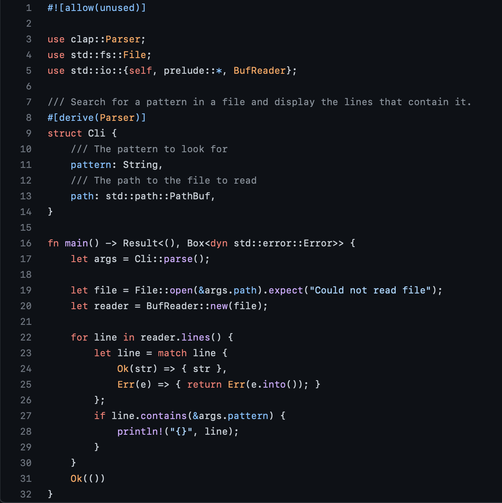
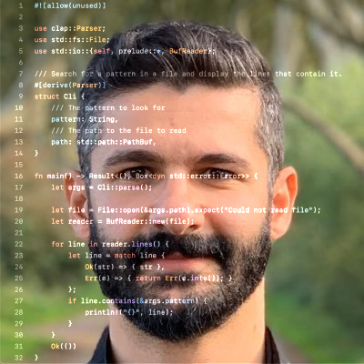

# Photo with code
@aslanon tweeted this: https://twitter.com/aslanon/status/1579766404383141888

So, I created this script for everyone to be able to call themselves 'Developer' :)

## Demo
<table>
  <tr>
    <td>Photo</td>
    <td>Code</td>
    <td>Output</td>
  </tr>
  <tr>
    <td></td>
    <td></td>
    <td></td>
   </tr> 
</table>

## Setup 
```
pip install opencv-python-headless
```

## Usage
```
python3 photowithcode.py -p photo.jpg -c code.png -d 1 -m 1
```
or
```
python3 photowithcode.py --Photo photo.jpg --Code code.png --Dim 1 --Mirror 1
```

## Tips
- The first image is the actual photo which we want to overlay some code on, image path should be passed using `-p` or `--Photo`
- The second image is the screenshot of the code we want to overlay, image path should be passed using `-c` or `--Code`
  - It has to have a dark background for the code, otherwise you won't get a proper output
  - If the background is not completely black but you want it to be, you can set the dim parameter using `-d` or `--Dim`
